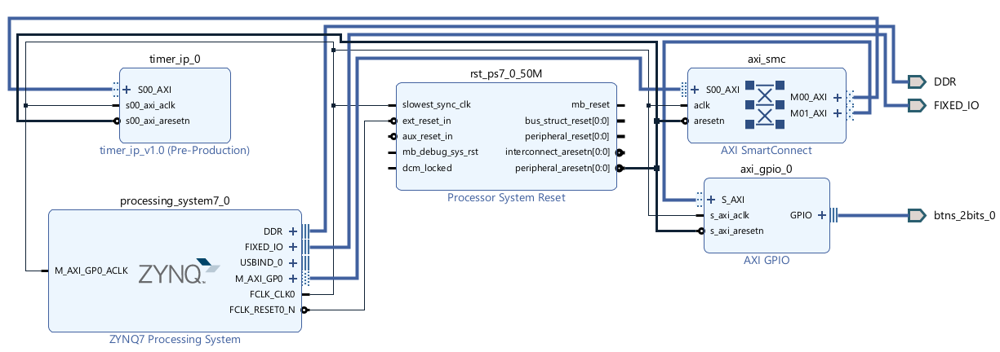

# cora-z7-hardware-timer
64-bit FPGA timer (Cora Z7) with 20-nanosecond precision. Built with custom Verilog IP and hardware-software control loops in C.

# 64-Bit Nanosecond Hardware Timer

A 64-bit hardware timer implemented on the Cora Z7 FPGA featuring start, stop, and reset functions. Achieves 20-nanosecond precision using custom Verilog IP and hardware-software control loops in C.

## Architectural Overview

Since a CPU is threaded carefully to be always busy, it cannot maintain a count which iterates at every rising or falling edge. To have a timer which is accurate at the nanosecond level, we can augment the CPU with an FPGA. 

The CPU sends control signals to the FPGA, and the FPGA writes back its current count. All communication between the FPGA and CPU is handled through the AXI4-Lite protocol. 

### Overcoming the 32-bit Limitation
Since communication on the AXI4 is typically 32 bits, a standard register running at a 50 MHz clock rate ($50,000,000$ ticks per second) yields a maximum count time of:
* $2^{32} = 4,294,967,295$ ticks
* $4,294,967,295 / 50,000,000 \approx 85.89$ seconds.

Our timer would not be able to measure beyond this limit. This is remedied by expanding the architecture—connecting two 32-bit registers to create a `count_lo` and `count_hi`. This allows us to count to $2^{64}$, increasing our maximum time to over 11,000 years with 20-nanosecond precision.

## Hardware & Tools
* **Development Board:** Digilent Cora Z7 (Zynq-7000 SoC)
* **Languages:** Verilog (Custom IP), C (Control Logic)
* **Toolchain:** Xilinx Vivado, Vitis IDE

## AXI4-Lite Control Signals
The CPU dictates the timer's state by writing the following signals to the control register:

| Signal | Action | Description |
| :--- | :--- | :--- |
| `1` | Start | Initiates or resumes the hardware counter |
| `0` | Pause | Halts the counter without clearing the current value |
| `2` | Reset | Clears `count_lo` and `count_hi` to zero |

